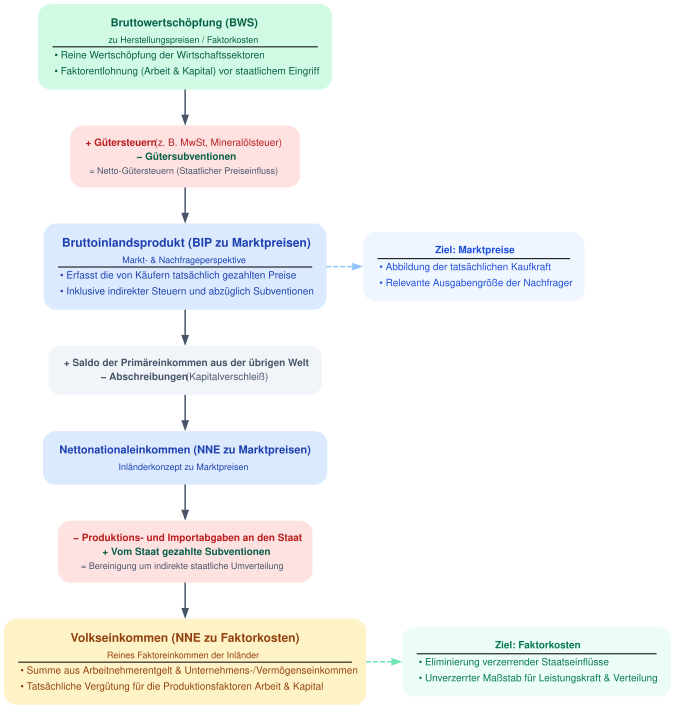

# Volkswirtschaftliche Gesamtrechnungen


::: {.callout-tip icon="false" collapse="true"}
# Der Podcast zur Vorlesung: Das BIP {.unnumbered}

<script class="podigee-podcast-player" src="https://player.podigee-cdn.net/podcast-player/javascripts/podigee-podcast-player.js" data-configuration="https://wirtschaftskunde.podigee.io/44-makro-am-mikro-02-das-bruttoinlandsprodukt/embed?context=external"></script>


:::

## Wozu VGR?

* **Messung der Wirtschaftsleistung:** Quantifizierung von Entstehung, Verteilung und Verwendung des Gesamteinkommens sowie aggregierter Kennzahlen (BIP, BNE, Nettonationaleinkommen).

* **Wirtschaftspolitische Entscheidungsgrundlage:** Datengrundlage für die Ausgestaltung von Finanzpolitik (Haushaltsplanung, Schuldenbremse), Geldpolitik (EZB) sowie Lohn- und Arbeitsmarktpolitik.

* **Konjunktur- und Strukturdiagnose:** Früherkennung von Auf- und Abschwüngen sowie Erfassung des strukturellen Wandels (z. B. Verteilung zwischen Industrie- und Dienstleistungssektor, Entwicklung der Staatsquote).

* **Basis für Prognosen und makroökonomische Forschung:** Empirisches Fundament für ökonometrische Modelle, Input-Output-Analysen und Konjunkturprognosen (z. B. Sachverständigenrat, Wirtschaftsforschungsinstitute).

* **Internationale Vergleichbarkeit:** Standardisierte Regelwerke (ESVG 2010 / SNA) ermöglichen den systematischen Vergleich von Wirtschaftsstruktur und Pro-Kopf-Einkommen zwischen Staaten.

* **Rechtliche und administrative Bemessungsfunktion:**
* Berechnung der BNE-basierten EU-Eigenmittelbeiträge der Mitgliedstaaten.
* Überwachung der europäischen Fiskalregeln (Defizit- und Schuldenstandsquote am BIP).
* Datengrundlage für amtliche Steuerschätzungen und gesetzliche Anpassungsmechanismen (z. B. Rentenentwicklung).


* **Verteilungsanalyse:** Erfassung der primären und sekundären Einkommensverteilung (Funktionale Verteilung wie Lohn- vs. Gewinnquote sowie verfügbares Einkommen der privaten Haushalte).

## Wichtiges Grundkonzept: Das Bruttoinlandsprodukt


### Definition und Berechnungswege

```{python}
#| output: false

import graphviz
from IPython.display import display

# Graph-Objekt initialisieren
dot = graphviz.Digraph(
    'BIP_Berechnungsmethoden',
    format='svg',
    comment='Drei Berechnungsmethoden des BIP'
)

# Globale Layout- und Design-Einstellungen
dot.attr(
    rankdir='TB',
    compound='true',
    nodesep='0.5',
    ranksep='0.8',
    fontname='Arial, sans-serif',
    bgcolor='#ffffff'
)

# Standard-Attributdefinitionen für Knoten und Kanten
dot.attr('node',
    fontname='Arial, sans-serif',
    shape='rectangle',
    style='filled, rounded',
    penwidth='1.5',
    fontsize='11'
)

dot.attr('edge',
    fontname='Arial, sans-serif',
    fontsize='10',
    penwidth='1.5'
)

# -----------------------------------------------------------------------------
# 1. CLUSTER: Entstehungsrechnung (Produktionsansatz)
# -----------------------------------------------------------------------------
with dot.subgraph(name='cluster_entstehung') as c:
    c.attr(
        label='Entstehungsrechnung\n(Produktionsansatz / Wo?)',
        style='filled, rounded',
        fillcolor='#f3f9f4',
        color='#2b8a3e',
        fontcolor='#2b8a3e',
        fontname='Arial-Bold',
        fontsize='13'
    )

    label_entstehung = '''<
    <TABLE BORDER="0" CELLBORDER="0" CELLSPACING="3">
        <TR><TD ALIGN="LEFT">Gesamter Produktionswert</TD></TR>
        <TR><TD ALIGN="LEFT"><FONT COLOR="#e03131">− Vorleistungen</FONT></TD></TR>
        <TR><TD ALIGN="LEFT" COLSPAN="1" BORDER="0" BOTTOM="1" CELLPADDING="0"></TD></TR> <!-- Horizontal rule -->
        <TR><TD ALIGN="LEFT"><B>= Bruttowertschöpfung (BWS)</B></TD></TR>
        <TR><TD ALIGN="LEFT"><FONT COLOR="#2b8a3e">+ Gütersteuern</FONT></TD></TR>
        <TR><TD ALIGN="LEFT"><FONT COLOR="#e03131">− Gütersubventionen</FONT></TD></TR>
    </TABLE>
    >'''

    c.node('entstehung', label=label_entstehung, fillcolor='#ffffff', color='#2b8a3e')

# -----------------------------------------------------------------------------
# 2. CLUSTER: Verwendungsrechnung (Ausgabenansatz)
# -----------------------------------------------------------------------------
with dot.subgraph(name='cluster_verwendung') as c:
    c.attr(
        label='Verwendungsrechnung\n(Ausgabenansatz / Wofür?)',
        style='filled, rounded',
        fillcolor='#edf2ff',
        color='#364fc7',
        fontcolor='#364fc7',
        fontname='Arial-Bold',
        fontsize='13'
    )

    label_verwendung = '''<
    <TABLE BORDER="0" CELLBORDER="0" CELLSPACING="3">
        <TR><TD ALIGN="LEFT">Private Konsumausgaben (<B>C</B>)</TD></TR>
        <TR><TD ALIGN="LEFT">+ Konsumausgaben des Staates (<B>G</B>)</TD></TR>
        <TR><TD ALIGN="LEFT">+ Bruttoinvestitionen (<B>I</B>)</TD></TR>
        <TR><TD ALIGN="LEFT">+ Außenbeitrag (<B>X − M</B>)</TD></TR>
        <TR><TD ALIGN="LEFT"><FONT POINT-SIZE="9" COLOR="#495057">  (Exporte X − Importe M)</FONT></TD></TR>
    </TABLE>
    >'''

    c.node('verwendung', label=label_verwendung, fillcolor='#ffffff', color='#364fc7')

# -----------------------------------------------------------------------------
# 3. CLUSTER: Verteilungsrechnung (Einkommensansatz)
# -----------------------------------------------------------------------------
with dot.subgraph(name='cluster_verteilung') as c:
    c.attr(
        label='Verteilungsrechnung\n(Einkommensansatz / Wie verteilt?)',
        style='filled, rounded',
        fillcolor='#fff9db',
        color='#e67700',
        fontcolor='#e67700',
        fontname='Arial-Bold',
        fontsize='13'
    )

    label_verteilung = '''<
    <TABLE BORDER="0" CELLBORDER="0" CELLSPACING="3">
        <TR><TD ALIGN="LEFT">Arbeitnehmerentgelt</TD></TR>
        <TR><TD ALIGN="LEFT">+ Unternehmens- &amp; Vermögenseinkommen</TD></TR>
        <TR><TD ALIGN="LEFT" COLSPAN="1" BORDER="0" BOTTOM="1" CELLPADDING="0"></TD></TR> <!-- Horizontal rule -->
        <TR><TD ALIGN="LEFT"><B>= Volkseinkommen</B></TD></TR>
        <TR><TD ALIGN="LEFT">+ Netto-Produktions- &amp; Importabgaben</TD></TR>
        <TR><TD ALIGN="LEFT">+ Abschreibungen</TD></TR>
        <TR><TD ALIGN="LEFT"><FONT COLOR="#e03131">− Saldo der Primäreinkommen (Ausland)</FONT></TD></TR>
    </TABLE>
    >'''

    c.node('verteilung', label=label_verteilung, fillcolor='#ffffff', color='#e67700')

# -----------------------------------------------------------------------------
# ZENTRALER KNOTEN: Bruttoinlandsprodukt (BIP)
# -----------------------------------------------------------------------------
label_bip = '''<
<TABLE BORDER="0" CELLBORDER="0" CELLSPACING="4">
    <TR><TD ALIGN="CENTER"><B><FONT POINT-SIZE="15" COLOR="#1864ab">BRUTTOINLANDSPRODUKT (BIP)</FONT></B></TD></TR>
    <TR><TD ALIGN="CENTER"><FONT POINT-SIZE="10" COLOR="#495057">Identisches Ergebnis aller drei Rechenwege</FONT></TD></TR>
</TABLE>
>'''

dot.node('bip', label=label_bip, fillcolor='#e7f5ff', color='#1864ab', penwidth='2.5', shape='component')

# -----------------------------------------------------------------------------
# VERBINDUNGEN / VERKNÜPFUNGEN
# -----------------------------------------------------------------------------
dot.edge('entstehung', 'bip', label=' = BIP', color='#2b8a3e', fontcolor='#2b8a3e')
dot.edge('verwendung', 'bip', label=' = BIP', color='#364fc7', fontcolor='#364fc7')
dot.edge('verteilung', 'bip', label=' = BIP', color='#e67700', fontcolor='#e67700')

# -----------------------------------------------------------------------------
# SPEICHERN ALS SVG UND AUSGABE IN IPYTHON
# -----------------------------------------------------------------------------
# Speichert die Datei als 'bip_berechnungsmethoden.svg' im aktuellen Verzeichnis
dot.render('bip_berechnungsmethoden', format='svg', cleanup=True)

# Anzeige in IPython / Jupyter Notebook
# display(dot)
```


## Verwandtes Konzept: Das Bruttonationaleinkommen

```{python}
#| output: false

import graphviz
from IPython.display import display, SVG

# Create Digraph
dot = graphviz.Digraph(
    name='bip_vs_bne',
    comment='Unterschied und Überleitung von BIP zu BNE',
    format='svg'
)

# Graph-Einstellungen (Modernes, übersichtliches Layout)
dot.attr(
    rankdir='TB',
    fontname='Helvetica, Arial, sans-serif',
    fontsize='12',
    bgcolor='#FFFFFF',
    nodesep='0.5',
    ranksep='0.5',
    compound='true'
)

# Standard-Attribute für Nodes
dot.attr('node',
    fontname='Helvetica, Arial, sans-serif',
    fontsize='10',
    shape='box',
    style='filled,rounded',
    penwidth='0',
    margin='0.2,0.15'
)

# Standard-Attribute für Edges
dot.attr('edge',
    fontname='Helvetica, Arial, sans-serif',
    fontsize='9',
    color='#64748B',
    penwidth='1.5',
    arrowsize='0.8'
)

# ==============================================================================
# 1. HAUPTKONZEPTE (BIP & BNE) + ÜBERLEITUNG
# ==============================================================================

# BIP Node (Inlandskonzept)
bip_label = '''<
<table border="0" cellborder="0" cellspacing="0" cellpadding="2">
  <tr><td><font point-size="12"><b>Bruttoinlandsprodukt (BIP)</b></font></td></tr>
  <tr><td><font color="#475569"><b>Inlandskonzept</b> (Ort der Wertschöpfung)</font></td></tr>
  <hr/>
  <tr><td align="left">• Leistung auf dem Staatsgebiet eines Landes</td></tr>
  <tr><td align="left">• Enthält Einkommen von Ausländern im Inland</td></tr>
</table>>'''

dot.node('BIP', label=bip_label, fillcolor='#DBEAFE', fontcolor='#1E40AF')

# Mathematische Überleitung
plus_label = '''<
<table border="0" cellborder="0" cellspacing="0" cellpadding="1">
  <tr><td><font color="#065F46"><b>+ Primäreinkommen aus der übrigen Welt</b></font></td></tr>
  <tr><td><font color="#047857" point-size="9">Einkommen von Inländern im Ausland (z.B. Zinsen, Dividenden, Pendlerlöhne)</font></td></tr>
</table>>'''

minus_label = '''<
<table border="0" cellborder="0" cellspacing="0" cellpadding="1">
  <tr><td><font color="#991B1B"><b>- Primäreinkommen an die übrige Welt</b></font></td></tr>
  <tr><td><font color="#B91C1C" point-size="9">Abflüsse an Ausländer im Inland (z.B. Gewinne ausländischer Konzerne, Pendlerlöhne)</font></td></tr>
</table>>'''

dot.node('PLUS', label=plus_label, fillcolor='#D1FAE5')
dot.node('MINUS', label=minus_label, fillcolor='#FEE2E2')

# BNE Node (Inländerkonzept)
bne_label = '''<
<table border="0" cellborder="0" cellspacing="0" cellpadding="2">
  <tr><td><font point-size="12"><b>Bruttonationaleinkommen (BNE)</b></font></td></tr>
  <tr><td><b>Inländerkonzept</b> (Wohnsitzprinzip, früher BSP)</td></tr>
  <hr/>
  <tr><td align="left">• Einkommen aller Personen mit Wohnsitz im Land</td></tr>
  <tr><td align="left">• Unabhängig davon, wo die Leistung erbracht wurde</td></tr>
</table>>'''

dot.node('BNE', label=bne_label, fillcolor='#1E40AF', fontcolor='#FFFFFF')

# ==============================================================================
# 2. PRAXISBEISPIELE & ABWEICHUNGEN
# ==============================================================================

bip_gt_bne_label = '''<
<table border="0" cellborder="0" cellspacing="0" cellpadding="2">
  <tr><td><b>BIP &gt; BNE</b></td></tr>
  <hr/>
  <tr><td align="left">• Hohe Abflüsse von Unternehmensgewinnen</td></tr>
  <tr><td align="left">• Viele ausländische Pendler / Grenzgänger</td></tr>
  <tr><td align="left"><i>Beispiele: Irland, Luxemburg</i></td></tr>
</table>>'''

bne_gt_bip_label = '''<
<table border="0" cellborder="0" cellspacing="0" cellpadding="2">
  <tr><td><b>BNE &gt; BIP</b></td></tr>
  <hr/>
  <tr><td align="left">• Hohe Rücküberweisungen von Emigranten</td></tr>
  <tr><td align="left">• Hohe Kapitaleinkünfte aus dem Ausland</td></tr>
  <tr><td align="left"><i>Beispiele: Entwicklungsländer, Netto-Kapitalanleger</i></td></tr>
</table>>'''

dot.node('CASE_BIP_GT', label=bip_gt_bne_label, fillcolor='#FEF3C7', fontcolor='#92400E')
dot.node('CASE_BNE_GT', label=bne_gt_bip_label, fillcolor='#F3E8FF', fontcolor='#6B21A8')

# ==============================================================================
# 3. VERBINDUNGEN (EDGES) & ANORDNUNG
# ==============================================================================

# Hauptfluss (Überleitung)
dot.edge('BIP', 'PLUS', label=' Saldo der Primäreinkommen')
dot.edge('PLUS', 'MINUS')
dot.edge('MINUS', 'BNE', label=' = BNE')

# Verknüpfung der Sonderfälle (gestrichelt)
dot.edge('BIP', 'CASE_BIP_GT', style='dashed', color='#CBD5E1', constraint='true')
dot.edge('BNE', 'CASE_BNE_GT', style='dashed', color='#CBD5E1', constraint='true')

# Ausrichtung der Sonderfälle auf gleicher Höhe
with dot.subgraph() as s:
    s.attr(rank='same')
    s.node('CASE_BIP_GT')
    s.node('CASE_BNE_GT')

# ==============================================================================
# 4. SPEICHERN (SVG) UND DISPLAY (IPython)
# ==============================================================================

# Generiert 'bip_vs_bne.svg' und löscht temporäre Dateien
output_file = dot.render(filename='bip_vs_bne', format='svg', cleanup=True)

print(f"SVG-Datei erfolgreich gespeichert unter: {output_file}")

# Anzeige in IPython / Jupyter Notebook
#display(SVG(filename=output_file))
```


```{r}
#| message: false
#| warning: false
#| fig-cap: "BIP vs. BNE in Deutschland und Irland"

library(rdbnomics)
library(dplyr)
library(tidyr)
library(ggplot2)

# 1. AMECO Series-IDs definieren
# OVGD = Reales BIP (Preise von 2015)
# OVGN = Reales BNE (Preise von 2015)
series_ids <- c(
  "AMECO/OVGD/DEU.1.1.0.0.OVGD",
  "AMECO/OVGN/DEU.1.1.0.0.OVGN",
  "AMECO/OVGD/IRL.1.1.0.0.OVGD",
  "AMECO/OVGN/IRL.1.1.0.0.OVGN"
)

# 2. Daten via DBnomics abrufen
df_raw <- rdb(ids = series_ids)

# 3. Aufbereiten und Zuordnen der Variablen
df_clean <- df_raw %>%
  filter(!is.na(value)) %>%
  mutate(
    year = as.numeric(substr(as.character(period), 1, 4)),
    # Land festlegen und Faktoren-Reihenfolge erzwingen (Links: DE, Rechts: IRL)
    country = case_when(
      tolower(geo) == "deu" ~ "Deutschland",
      tolower(geo) == "irl" ~ "Irland",
      TRUE ~ toupper(geo)
    ),
    country = factor(country, levels = c("Deutschland", "Irland")),
    
    # Indikator identifizieren
    indicator = case_when(
      grepl("OVGD", series_code) ~ "Reales BIP",
      grepl("OVGN", series_code) ~ "Reales BNE",
      TRUE ~ "Sonstiges"
    )
  ) %>%
  select(country, year, indicator, value) %>%
  filter(year >= 1990) # Fokus auf die Entwicklung seit 1990

# 4. Visualisierung mit ggplot2 & facet_wrap
ggplot(df_clean, aes(x = year, y = value, color = indicator, linetype = indicator)) +
  geom_line(linewidth = 1) +
  facet_wrap(~ country, scales = "free_y", ncol = 2) +
  scale_color_manual(
    values = c("Reales BIP" = "#1F78B4", "Reales BNE" = "#E31A1C")
  ) +
  scale_linetype_manual(
    values = c("Reales BIP" = "solid", "Reales BNE" = "dashed")
  ) +
  labs(
    title    = "Reales BIP vs. Reales BNE im Vergleich (1990–heute)",
    subtitle = "Starke Entkopplung in Irland durch Primäreinkommensabflüsse",
    x        = NULL,
    y        = "Milliarden Euro (Preise von 2015)",
    color    = NULL,
    linetype = NULL,
    caption  = "Daten: AMECO (OVGD / OVGN) via DBnomics. Darstellung Jan S. Voßwinkel"
  ) +
  theme_minimal(base_size = 12) +
  theme(
    legend.position  = "bottom",
    strip.text       = element_text(face = "bold", size = 12),
    plot.title       = element_text(face = "bold", size = 14),
    plot.subtitle    = element_text(color = "gray30"),
    panel.grid.minor = element_blank(),
    panel.spacing    = unit(1.5, "lines")
  )
```

## Marktpreise vs. Faktorkosten

```{python}
#| output: false


import graphviz
# from IPython.display import display, SVG

# Graphviz-Objekt initialisieren
dot = graphviz.Digraph(
    name='bip_marktpreise_vs_faktorkosten',
    comment='Marktpreise vs. Faktorkosten in der VGR',
    format='svg'
)

# Globale Layout-Einstellungen
dot.attr(
    rankdir='TB',
    fontname='Helvetica, Arial, sans-serif',
    fontsize='12',
    bgcolor='#FFFFFF',
    nodesep='0.5',
    ranksep='0.5',
    compound='true'
)

# Standard-Attribute für Knoten
dot.attr('node',
    fontname='Helvetica, Arial, sans-serif',
    fontsize='10',
    shape='box',
    style='filled,rounded',
    penwidth='0',
    margin='0.2,0.15'
)

# Standard-Attribute für Verbindungen
dot.attr('edge',
    fontname='Helvetica, Arial, sans-serif',
    fontsize='9',
    color='#475569',
    penwidth='1.5',
    arrowsize='0.8'
)

# ==============================================================================
# 1. STUFE: ENTSTEHUNGSRECHNUNG (Von Faktorkosten zu Marktpreisen)
# ==============================================================================

bws_label = '''<
<table border="0" cellborder="0" cellspacing="0" cellpadding="2">
  <tr><td><font point-size="11"><b>Bruttowertschöpfung (BWS)</b></font></td></tr>
  <tr><td><font color="#065F46" point-size="9">zu Herstellungspreisen / Faktorkosten</font></td></tr>
  <hr/>
  <tr><td align="left">• Reine Wertschöpfung der Wirtschaftssektoren</td></tr>
  <tr><td align="left">• Faktorentlohnung (Arbeit &amp; Kapital) vor staatlichem Eingriff</td></tr>
</table>>'''

tax1_label = '''<
<table border="0" cellborder="0" cellspacing="0" cellpadding="1">
  <tr><td><font color="#B91C1C"><b>+ Gütersteuern</b> (z. B. MwSt, Mineralölsteuer)</font></td></tr>
  <tr><td><font color="#065F46"><b>− Gütersubventionen</b></font></td></tr>
  <tr><td><font color="#475569" point-size="9">= Netto-Gütersteuern (Staatlicher Preiseinfluss)</font></td></tr>
</table>>'''

bip_mp_label = '''<
<table border="0" cellborder="0" cellspacing="0" cellpadding="2">
  <tr><td><font point-size="12"><b>Bruttoinlandsprodukt (BIP zu Marktpreisen)</b></font></td></tr>
  <tr><td><font color="#1E40AF" point-size="9">Markt- &amp; Nachfrageperspektive</font></td></tr>
  <hr/>
  <tr><td align="left">• Erfasst die von Käufern tatsächlich gezahlten Preise</td></tr>
  <tr><td align="left">• Inklusive indirekter Steuern und abzüglich Subventionen</td></tr>
</table>>'''

dot.node('BWS', label=bws_label, fillcolor='#D1FAE5', fontcolor='#065F46')
dot.node('TAX1', label=tax1_label, fillcolor='#FEE2E2', fontcolor='#991B1B')
dot.node('BIP_MP', label=bip_mp_label, fillcolor='#DBEAFE', fontcolor='#1E40AF')

# ==============================================================================
# 2. ÜBERLEITUNG INLANDS- ZU INLÄNDER- UND NETTOKONZEPT
# ==============================================================================

trans_label = '''<
<table border="0" cellborder="0" cellspacing="0" cellpadding="1">
  <tr><td><font color="#475569"><b>+ Saldo der Primäreinkommen aus der übrigen Welt</b></font></td></tr>
  <tr><td><font color="#475569"><b>− Abschreibungen</b> (Kapitalverschleiß)</font></td></tr>
</table>>'''

nne_mp_label = '''<
<table border="0" cellborder="0" cellspacing="0" cellpadding="2">
  <tr><td><font point-size="11"><b>Nettonationaleinkommen (NNE zu Marktpreisen)</b></font></td></tr>
  <tr><td><font color="#1E40AF" point-size="9">Inländerkonzept zu Marktpreisen</font></td></tr>
</table>>'''

dot.node('TRANS', label=trans_label, fillcolor='#F1F5F9', fontcolor='#334155')
dot.node('NNE_MP', label=nne_mp_label, fillcolor='#DBEAFE', fontcolor='#1E40AF')

# ==============================================================================
# 3. STUFE: VERTEILUNGSRECHNUNG (Rückkehr zu Faktorkosten = Volkseinkommen)
# ==============================================================================

tax2_label = '''<
<table border="0" cellborder="0" cellspacing="0" cellpadding="1">
  <tr><td><font color="#B91C1C"><b>− Produktions- und Importabgaben an den Staat</b></font></td></tr>
  <tr><td><font color="#065F46"><b>+ Vom Staat gezahlte Subventionen</b></font></td></tr>
  <tr><td><font color="#475569" point-size="9">= Bereinigung um indirekte staatliche Umverteilung</font></td></tr>
</table>>'''

ve_label = '''<
<table border="0" cellborder="0" cellspacing="0" cellpadding="2">
  <tr><td><font point-size="12"><b>Volkseinkommen (NNE zu Faktorkosten)</b></font></td></tr>
  <tr><td><font color="#92400E" point-size="9">Reines Faktoreinkommen der Inländer</font></td></tr>
  <hr/>
  <tr><td align="left">• Summe aus Arbeitnehmerentgelt &amp; Unternehmens-/Vermögenseinkommen</td></tr>
  <tr><td align="left">• Tatsächliche Vergütung für die Produktionsfaktoren Arbeit &amp; Kapital</td></tr>
</table>>'''

dot.node('TAX2', label=tax2_label, fillcolor='#FEE2E2', fontcolor='#991B1B')
dot.node('VE', label=ve_label, fillcolor='#FEF3C7', fontcolor='#92400E')

# ==============================================================================
# 4. ANALYTISCHER ZWECK (SEITLICHE INFO-BOXEN)
# ==============================================================================

purpose_mp = '''<
<table border="0" cellborder="0" cellspacing="0" cellpadding="2">
  <tr><td><b>Ziel: Marktpreise</b></td></tr>
  <hr/>
  <tr><td align="left">• Abbildung der tatsächlichen Kaufkraft</td></tr>
  <tr><td align="left">• Relevante Ausgabengröße der Nachfrager</td></tr>
</table>>'''

purpose_fk = '''<
<table border="0" cellborder="0" cellspacing="0" cellpadding="2">
  <tr><td><b>Ziel: Faktorkosten</b></td></tr>
  <hr/>
  <tr><td align="left">• Eliminierung verzerrender Staatseinflüsse</td></tr>
  <tr><td align="left">• Unverzerrter Maßstab für Leistungskraft &amp; Verteilung</td></tr>
</table>>'''

dot.node('PURPOSE_MP', label=purpose_mp, fillcolor='#EFF6FF', fontcolor='#1D4ED8')
dot.node('PURPOSE_FK', label=purpose_fk, fillcolor='#ECFDF5', fontcolor='#047857')

# ==============================================================================
# 5. VERBINDUNGEN (VERLAUF)
# ==============================================================================

# Hauptpfad
dot.edge('BWS', 'TAX1')
dot.edge('TAX1', 'BIP_MP')
dot.edge('BIP_MP', 'TRANS')
dot.edge('TRANS', 'NNE_MP')
dot.edge('NNE_MP', 'TAX2')
dot.edge('TAX2', 'VE')

# Zuordnung zu den Info-Boxen (gestrichelt)
dot.edge('BIP_MP', 'PURPOSE_MP', style='dashed', color='#93C5FD', constraint='false')
dot.edge('VE', 'PURPOSE_FK', style='dashed', color='#6EE7B7', constraint='false')

# Rang-Ausrichtungen für ein ausgewogenes Layout
with dot.subgraph() as s:
    s.attr(rank='same')
    s.node('BIP_MP')
    s.node('PURPOSE_MP')

with dot.subgraph() as s:
    s.attr(rank='same')
    s.node('VE')
    s.node('PURPOSE_FK')

# ==============================================================================
# 6. SPEICHERN (SVG) UND DISPLAY (IPython)
# ==============================================================================

output_file = dot.render(filename='bip_marktpreise_vs_faktorkosten', format='svg', cleanup=True)

print(f"SVG-Datei erfolgreich gespeichert unter: {output_file}")

# Anzeige im Jupyter Notebook / IPython
# display(SVG(filename=output_file))
```



```{r}
#| message: false
#| warning: false
#| fig-cap: "Wohin fließen Erlöse?"

library(dplyr)
library(tidyr)
library(ggplot2)

df <- data.frame(
  Situation = c("Situation 1", "Situation 2"),
  Lohn = c(100, 100),
  Kapitalentlohnung = c(80, 80),
  Gütersteuern = c(30, 60)
)

# Daten ins Long-Format bringen und Faktor-Reihenfolge für das Stacking festlegen
df_long <- df %>%
  pivot_longer(
    cols = c(Lohn, Kapitalentlohnung, Gütersteuern),
    names_to = "Komponente",
    values_to = "Wert"
  ) %>%
  mutate(Komponente = factor(Komponente, levels = c("Gütersteuern", "Lohn", "Kapitalentlohnung")))

# Gestapeltes Säulendiagramm erstellen
ggplot(df_long, aes(x = Situation, y = Wert, fill = Komponente)) +
  geom_bar(stat = "identity", width = 0.5) +
  scale_fill_brewer(palette = "Set2") +
  labs(
    title = "Wohin fließen Erlöse?",
    x = NULL,
    y = "Wert",
    fill = "Komponente"
  ) +
  theme_minimal(base_size = 14)
```


```{r}
#| warning: false
#| message: false

library(rdbnomics)
library(dplyr)
library(ggplot2)

message("Lade ALCD2 aus der AMECO-Datenbank via DBnomics...")

# 1. Länderliste (ISO3-Codes)
eu_countries <- c("DEU", "FRA", "ITA", "ESP", "NLD", "AUT", "GRC", "SWE", "POL", "USA")

# 2. Series-IDs konstruieren und Daten abrufen
series_ids <- paste0(eu_countries, ".1.0.0.0.ALCD2")
ameco_alcd2 <- rdb(ids = paste0("AMECO/ALCD2/", series_ids))

# 3. Ländernamen für die Beschriftung
country_names <- c(
  "DEU" = "Deutschland",
  "FRA" = "Frankreich",
  "ITA" = "Italien",
  "ESP" = "Spanien",
  "NLD" = "Niederlande",
  "AUT" = "Österreich",
  "GRC" = "Griechenland",
  "SWE" = "Schweden",
  "POL" = "Polen",
  "USA" = "USA"
)

# 4. Daten aufbereiten – Zeitreihe für alle Jahre
wage_share_clean <- ameco_alcd2 %>%
  # geo in Großbuchstaben für das Mapping
  mutate(geo_upper = toupper(geo)) %>%
  # Jahr aus period extrahieren (robust für "YYYY" oder Datum)
  mutate(year = as.numeric(substr(as.character(period), 1, 4))) %>%
  # Ländernamen hinzufügen
  mutate(country = country_names[geo_upper]) %>%
  # Relevante Spalten auswählen und umbenennen
  select(country, year, Lohnquote = value) %>%
  # Nur vollständige Zeilen behalten
  filter(!is.na(Lohnquote) & !is.na(country))

# 5. Zeitreihenplot erstellen
ggplot(wage_share_clean, aes(x = year, y = Lohnquote, color = country)) +
  geom_line(linewidth = 0.8) +
  geom_point(size = 1.5) +
  scale_color_brewer(palette = "Set1", name = "Land") +
  labs(
    title    = "Bereinigte Lohnquote (ALCD2) in ausgewählten EU-Ländern",
    subtitle = "Zeitreihe aus AMECO via DBnomics",
    x        = "Jahr",
    y        = "Bereinigte Lohnquote (in % vom BIP zu Faktorkosten)",
    caption  = "Datenquelle: EU-Kommission / AMECO via DBnomics"
  ) +
  theme_minimal(base_size = 12) +
  theme(
    plot.title   = element_text(face = "bold"),
    legend.position = "bottom",
    legend.title = element_text(face = "bold")
  )
```

## Schwankungen des BIPs: Konjunktur

### Methodische Vorbemerkung: Logarithmierte Daten {-}

- Makroökonomische Zeitreihen verwenden regelmäßig logarithmierte Daten

- Grundidee: ökonomische Aggregate verändern sich relativ zu ihrer Größe

- Absolut gesehen schwankt das BIP einer großen Volkswirtschaft c.p. stärker als das einer kleinen

- Relativ gesehen aber nicht. 

Es wird ein exponenzielles Wachstumsmodell angenommen: 

$Y(t) = Y_{t-1} \times e^{r}$

Die Differenz der logarithmierten Größen entspricht dann der gesuchten Wachstumsrate $r$.

$\iff ln(Y_t)= ln(Y_{t-1}) +r$

$\iff r=ln(Y_t)-ln(Y_{t-1})$

### Stilisierter Konjunkturverlauf

```{r}
#| message: false
#| warning: false
#| fig-cap: "Stilisierter Konjunkturverlauf"

library(dplyr)
library(ggplot2)

# Data Frame erstellen und Phase + Block-ID ergänzen
df <- data.frame(x = seq(0, 20, by = 0.2)) %>%
  mutate(
    sinus = sin(x),
    y = 0.35 * x + 0.4 * sinus,
    Phase = case_when(
      sinus < 0  & cos(x) >= 0 ~ "Erholung",
      sinus >= 0 & cos(x) >= 0 ~ "Boom",
      sinus >= 0 & cos(x) < 0  ~ "Abkühlung",
      sinus < 0  & cos(x) < 0  ~ "Rezession"
    ),
    Phase = factor(Phase, levels = c("Erholung", "Boom", "Abkühlung", "Rezession")),
    # Generiert eine fortlaufende ID pro Phasenblock (verhindert Fehlverbindungen im Ribbon)
    block_id = consecutive_id(Phase)
  )

# Plot mit Hintergrundbändern
df %>%
  ggplot(aes(x = x, y = y)) +
  # Farblicher Hintergrund über

  geom_ribbon(
  aes(ymin = 0.35 * x, ymax = y, fill = Phase, group = block_id),
  alpha = 0.4
)+

  # Trendlinie (gestrichelt)
  geom_line(aes(y = 0.35 * x), color = "blue", linetype = "dashed", linewidth = 0.8) +
  # Konjunkturverlauf (durchgezogen)
  geom_line(color = "black", linewidth = 0.9) +
  scale_fill_manual(values = c(
    "Erholung"  = "yellow",
    "Boom"      = "green",
    "Abkühlung" = "orange",
    "Rezession" = "red"
  )) +
  # Achsenbeschriftungen / Breaks entfernen
  scale_x_continuous(breaks = NULL) +
  scale_y_continuous(breaks = NULL) +
  theme_light() +
  labs(
    title = "Stilisierter Konjunkturverlauf",
    x = "Zeit",
    y = "BIP",
    fill = "Konjunkturphase"
  )
```


```{python}
#| output: false

import graphviz
from IPython.display import display, SVG

# Digraph mit der 'circo'-Engine für eine automatische kreisförmige Anordnung
dot = graphviz.Digraph(
    name='konjunkturzyklus',
    comment='Vier Phasen des Konjunkturzyklus',
    engine='circo'
)

# Globale Layout- und Stileinstellungen
dot.attr(
    bgcolor='white',
    label='Idealtypischer Konjunkturzyklus\n ',
    labelloc='t',
    fontname='Helvetica-Bold',
    fontsize='14'
)

dot.attr('node',
    shape='box',
    style='filled,rounded',
    fontname='Helvetica',
    fontsize='10',
    margin='0.2,0.15',
    penwidth='1.5'
)

dot.attr('edge',
    fontname='Helvetica',
    fontsize='9',
    penwidth='1.5',
    arrowsize='0.8',
    color='#424242'
)

# 1. Aufschwung / Erholung
dot.node('aufschwung',
    label='1. Aufschwung / Erholung\n\n• Anziehende Nachfrage\n• Steigende Auslastung\n• Stellenaufbau & Abbau von Unterkapazitäten',
    fillcolor='#E8F5E9',
    color='#2E7D32',
    fontcolor='#1B5E20'
)

# 2. Hochkonjunktur / Boom
dot.node('boom',
    label='2. Hochkonjunktur / Boom\n\n• Überauslastung des Potenzials\n• Kapazitätsengpässe & Überstunden\n• Verstärkter Inflationsdruck',
    fillcolor='#FFF3E0',
    color='#E65100',
    fontcolor='#BF360C'
)

# 3. Abschwung / Abkühlung
dot.node('abschwung',
    label='3. Abschwung / Abkühlung\n\n• Nachlassendes Nachfragewachstum\n• Investitionsrückgang\n• Nachlassender Preisdruck',
    fillcolor='#ECEFF1',
    color='#546E7A',
    fontcolor='#263238'
)

# 4. Konjunkturtief / Rezession
dot.node('tief',
    label='4. Konjunkturtief / Rezession\n\n• Deutliche Unterauslastung\n• Steigende Arbeitslosigkeit & Insolvenzen\n• Geringer Preisdruck / Deflationstendenzen',
    fillcolor='#FFEBEE',
    color='#C62828',
    fontcolor='#880E4F'
)

# Phasenübergänge (gerichteter Kanten-Zyklus)
dot.edge('aufschwung', 'boom', label=' Beschleunigung')
dot.edge('boom', 'abschwung', label=' Wendepunkt (Hochpunkt)')
dot.edge('abschwung', 'tief', label=' Unterschreiten d. Potenzials')
dot.edge('tief', 'aufschwung', label=' Impulse / Marktmechanismen')

# 1. Als SVG-Datei speichern ('konjunkturzyklus.svg')
dot.render('konjunkturzyklus', format='svg', cleanup=True)

# 2. Direkt in IPython / Jupyter Notebook rendern
#display(SVG(filename='konjunkturzyklus.svg'))
```


### Probleme des stilisierten Konjunktuverlaufs

- Empirische Konjunkturverläufe sind nicht so schön symmetrisch

- Was ist der Trend? Er ist nicht (direkt) beobachtbar  
  - Entweder ex ante Potenzialoutput schätzen (hohe Informationsanforderungen) oder  
  - ex post möglichst gute Anpassung an die Beobachtungen finden
  
  - einfacher linearer Trend ist aber vermutlich nicht sinnvoll
  
  - daher Filter, der sowohl langfristige Entwicklungen als auch *Änderungen* der langfristigen Entwicklungen berücksichtigt
  
### Der Hodrick-Prescott-Filter

$$HP= min_{T_t} \left( \sum_{t=1}^{N} (Y_t - T_t)^2 + \lambda \sum_{t=2}^{N-1} ((T_{t+1} - T_t) - (T_t - T_{t-1}))^2 \right)$$
Die Gleichung hat zwei Komponenten

- **Anpassungsgüte** ($\sum (Y_t - T_t)^2$): Der erste Teil der Gleichung bestraft die Abweichung des Trends ($T_t$) von der ursprünglichen Zeitreihe ($Y_t$). Je größer die Abweichungen, desto größer ist dieser Term. Dies stellt sicher, dass der Trend den Daten "folgt".

- **Glättungskomponente** ($\lambda \sum ((T_{t+1} - T_t) - (T_t - T_{t-1}))^2$): Der zweite Teil bestraft die Veränderung der Wachstumsrate des Trends. Er sorgt dafür, dass der Trend möglichst glatt und nicht "zackig" ist.

Wahl von $\lambda$: Für Jahresdaten sind Werte wie 6,25 oder 100 üblich.

```{r}
#| message: false
#| warning: false

library(rdbnomics)
library(dplyr)
library(tidyr)
library(ggplot2)
library(mFilter)

# ------------------------------------------------------------------------------
# 0. Konfiguration
# ------------------------------------------------------------------------------
LAMBDA <- 6.25 # Ravn & Uhlig (2002) Standard für Jahresdaten

# ------------------------------------------------------------------------------
# 1. Lookup-Tabelle für G7-Länder & AMECO-Series-Codes
# ------------------------------------------------------------------------------
g7_df <- tibble(
  series_code = paste0(c("DEU", "FRA", "ITA", "GBR", "CAN", "JPN", "USA"), ".1.1.0.0.OVGD"),
  country   = factor(
    c("Deutschland", "Frankreich", "Italien", "Großbritannien", "Kanada", "Japan", "USA"),
    levels = c("Deutschland", "Frankreich", "Italien", "Großbritannien", "Kanada", "Japan", "USA")
  )
)

api_ids <- paste0("AMECO/OVGD/", g7_df$series_code)

# ------------------------------------------------------------------------------
# 2. Daten via DBnomics abrufen und aufbereiten
# ------------------------------------------------------------------------------
gdp_data <- rdb(ids = api_ids) %>%
  filter(!is.na(value)) %>%
  inner_join(g7_df, by = "series_code") %>%
  mutate(year = as.numeric(substr(as.character(period), 1, 4))) %>%
  select(country, year, value) %>%
  arrange(country, year)

# ------------------------------------------------------------------------------
# 3. HP-Filter anwenden & Daten im Logarithmus belassen
# ------------------------------------------------------------------------------
gdp_hp <- gdp_data %>%
  group_by(country) %>%
  group_modify(~ {
    log_y <- log(.x$value)
    hp    <- hpfilter(log_y, freq = LAMBDA, type = "lambda")
    
    .x %>%
      mutate(
        log_bip   = log_y,
        log_trend = as.numeric(hp$trend),
        cycle     = as.numeric(hp$cycle) * 100  # Zyklische Komponente in %
      )
  }) %>%
  ungroup()

# -----------------------------------------


# ------------------------------------------------------------------------------
# 1. Funktion zur Erstellung einzelner Plots für ein bestimmtes Land
# ------------------------------------------------------------------------------
plot_country_hp <- function(df, target_country) {
  df %>%
    filter(country == target_country) %>%
    ggplot(aes(x = year)) +
    geom_line(aes(y = log_bip, color = "Log(Reales BIP)"), linewidth = 0.9) +
    geom_line(aes(y = log_trend, color = "HP-Trend (Log)"), linewidth = 0.9, linetype = "dashed") +
    geom_smooth(aes(y = log_bip, color = "Linearer OLS-Trend"), method = "lm", se = FALSE, linetype = "dotted", linewidth = 0.7) +
    scale_color_manual(
      name   = NULL,
      values = c(
        "Log(Reales BIP)"   = "#1F78B4",
        "HP-Trend (Log)"     = "#E31A1C",
        "Linearer OLS-Trend" = "#33A02C"
      )
    ) +
    labs(
      title    = paste("Logarithmiertes reales BIP und HP-Trend:", target_country),
      subtitle = paste0("Vergleich von Log-BIP, geglättetem HP-Trend (λ = ", LAMBDA, ") und linearem Trend"),
      x        = "Jahr",
      y        = "Logarithmiertes reales BIP",
      caption  = "Datenquelle: AMECO (OVGD) via DBnomics"
    ) +
    theme_minimal(base_size = 12) +
    theme(
      legend.position  = "bottom",
      plot.title       = element_text(face = "bold", size = 14),
      plot.subtitle    = element_text(color = "gray30"),
      panel.grid.minor = element_blank()
    )
}

# ------------------------------------------------------------------------------
# 2. Einzelne Plots aufrufen und in Variablen speichern
# ------------------------------------------------------------------------------
p_deu <- plot_country_hp(gdp_hp, "Deutschland")
p_fra <- plot_country_hp(gdp_hp, "Frankreich")
p_ita <- plot_country_hp(gdp_hp, "Italien")
p_usa <- plot_country_hp(gdp_hp, "USA")

# Einzelnen Plot anzeigen (z. B. Deutschland)
p_deu
p_fra
p_ita
p_usa
```

::: {.callout-note icon="false" collapse="true"}
# Der HP Filter und die deutsche Konjuktur  {.unnumbered}

<iframe src=https://shinylive.io/r/app/#code=NobwRAdghgtgpmAXGKAHVA6ASmANGAYwHsIAXOMpMAGwEsAjAJykYE8AKAZwAtaJWAlAB0IIgMQACAIwYJAESjkI9KJ1qcJ7OQFEAqhKxwo1OBoBCASQAK0gJwB2AAwBaAEyPXAZmEQAJgDMJAB5nCU5SRgBXAlJIxjh2OnD2YkiyNgB9Yl84CQBeCQJ2ITAdXRLcCRKyiqrSvVrqhrw6mrwRJvKWzsb6rsqe7r7etoHhodHW5twO8bHJwfnpqf6VkeXFtfbROa2l1c3D3aOFudnTi43j68uDm+nzq9v1u+eJp4-+x9fPl5KBSqsIyMfKFdhSByOSoQ+xSaEOVzw+yeGYQGEAFiRAFYkQA2JH2JEADiRtnhRKhdiJcKpiKpKKpmJEEKJOKp+KphKpJKpZLstkpENsNKFdKFDKFmP5OOZtlsHKFXKFPKFfPcjkp6pp6rp6oZ6ql6rZ6vxInVXPVPPVascUk1tu1tt1tv1tsNtuNto57ikhLNtqttpt7kq7lcjtczq8AIk9FoqFBRSknlsRPsRPRmYFuMcGHsZOZmdcOfRUlxWKJnk8GFcSqxjnRuNLjlx2axGCxYqx9nLrnrqeF6IwKehWIFWO7fZzjnsw6ZaO7uPssNrPc8Q+70PL6IpDlx4eRHZVsKDqax6M8GYwRIVPbLWLtth3KYwqdRUkr6J7ObLM9zuJVG8WykL8+ztatN2kNMG1xD9OyJVxbDzaEb08GdyxbexuzzRFmSJWwvFhWEpHDdsn3hdFuwIzwezlIcR35O18LLS8AOvQNPFxXFPHDWtXEzDs4X9csPzTBw7xrQ0QN9etwyrGc829SNOxg30dzI7V1zkgiJx3JChIgfjYPTODWNxDB91DfsSMvRxOKrYcLR3RtkwvLx3AwKRjXPdEG1rOy5VzZFUT7SseKbWT6wwFtQxLED1xvECiU82L62pFM+3RVxkpiiR-NLOUsU4kDzPsXDDKwzsEovB9koI0NK3PalkzlAjhzVIlKy8zrYIiySGuXSjHHlJKh0QkLWWRRwfNhNiPwagVOuTBtiostVhXcddHHw2wJw7Dk0K8X1bXzdTPPKzwpGTLyEq03MEMqS6LzsscnztIcPFDeVfO-ACc3bB9Hu2-NYTHaa+wskkRB44aPz82CP08rkeMjWD0J2gGeR4ziV249dz1fR60IQxD3GfJCG1RKtuwrbsIU8B99setzKNTHtKPbabHs7TNu2RXzS2HLGJwFXybzA1wLJlCAGYcS7kRo9En36iR8flLFuK8DV7rpBnWyu4r5ScPMaXshn82LOUPMuqn934q20MvJCaIEGNGCIAB3DBoHgDQCiKAA5ABBSpnHPAAZGMCGoVQ-bBEpSHoagMgCCpZkT6hel8RQoAwfxmHgf4fHEPLZAACSsZwADFaGocgQXYMxVFyLAJAAWUURhaAALwoeICG4CA0gAcx8bhUAyfxa-rjIVE4XIQgkfw0hiWgSHYVhKhjmB6Gz0FzL7AQJBAEQJAkAA3YxaF8DJr4AD2CUIAEJ1G9qAN58M-WCyEwoAgM-H4SFYMAS+dAb73wALqnwkP-ABcDAEmAgMPUg3AN4-yMBAYusDaCBHYP-IIEh0RH3CEQVAxQwBtz4DkcIFANDogkGYOARAVAD1iEgigEg4CMH8EQRgORGB0AHhgf4HRYEWEAb4WgUBh54M-vIQBMBO60DvuwSkEB3Ye1BP-UIdIIDEGoFouRPCG60AkHwaQiA8ESB0a7Y+0Cz5yGALQSotAIHwMXlIex8gnEuIkAAamkG4xebgvGOOcWY-xeUgmhE8bAgAvqIs+Qd3GhHEQE7eu8oASAAFSaFIFoI+ABSbJhT5ByIiBQXwgDOBEGoOfBIIcgHoL-nIggrBo4L1CN-Dpf9rESAqX4RJEh4icAyAMqpi94hkODhkeIxgMhbwoMg1Bgg5EjKyO0kwgCpnsBmXM5OiykEoI-lgs+6zxkgKvuA3wd9okSFUBgepMReHsHGWs0wGyOmXLAbfG5dyHlPNIC8tpHTTnDLgLERgEB2DZ1ILnfOsAEhePGaCc58Q-CojgSCrZBR1nYrgNA12IgEmiAgJIasEhdAWGcHIOAU8IC0FIGvUlkRTGL38NQVlvgrDSKRbAplpATA8ogHAag5Cy5EF8F3AgABrZwVgRnEFIKQCQNc65cM0IYYwpgGHWHkHASIpBOADxjn4YQYAATQOgWoHIKhGDhygKwIghriiwLPjauAdrhWitdfAsIYCuEWAgKgF1Xi4F8BDaQCwVSCglAydnNObr4Ex3oKKgBBQy4ABU27h3IQAcWoAAE+VSPTgqAWCIvrpoAAZPGqAABuAQiB-iYr9RIGA5i4EFChGGgBiiH5dryhqVtfrQGRFyGfAoB9pZtrCOQBM6aJC5j7L2y1Saz7cEYOwNdfq4XD04AAEkkefX1bbwisBxXUHhZBnBqF7ogJdr44AwHrYUWpvCH1iAnFietibZ17sPfQchWBaCsI9lw8gS8AA-IIABSUBN2mFhRQZtFqR3wIAweyIYre1wMw3QV50jAPkMAN3A+8axYlQzGEoBgoDnwgM4XQ3A6DDwkAAZThX4FgvgW24YAfh2ghH90HqAyUMjBQ7SOCo2MSljAy2MCg0gwR3ANUV2cBxv+2c+G8fXRhojB6COYdE2AcTS7pN1AkAAaTgHwLhJhTEFuLWw1j7BM3opjbqqw5q5F+p8wAvzO6AFeMUXwb1OHdOoGoEQUgAB5Q1kbyHjwyJF6LtQVO0GHtwFVsawDTlQHfERSa5E+CwZIIc7GuH1MYM4cORBh60BlSIeejAquAOXnopl68I2GsqM60gkbKjz04GoEgR8T6wOgX1yNB6kspZVZMypXCrBRfyeNuBUXh6z3jAgurML-AifjH5rxkg1VVrmTKpl59YxcLgAPEVpK4FJZGYApLU91WMFns3RIdWtuoC3rATJoJuukAMwD7OR2k2SGW9Fmrjq+sPtcBIAAWjZxBmgy4ADeVMQCq9wQtdcGUaE8IgKQfnh5dxvooiIyiFFKJUUmUMMZ1Ge1BLo-RoJSdeJjk6l15Pr4ZCp13O+lR0uZaNYmdgEoiVJq8eWrdiiQT+3YFKDcoYOzQml3A47EgYupviCCaHpAH0B1oPUqAkQL6cFkG5ypsuVunrgQEA9QIWBbx+3GP7vbSCsFQLkHL9BaioAHhzjk7OctiCkFXdMZh0S1GoB7DzMgZ3wLvim0EJRagXqgPQdPYBasyMsF5v98CQv-wKOWmhjhgNGBMOYPVaQqlqZt34TQpnajuwb+wYHoOd7Z0Z2MbzXiycU5SLU3PLGsvk8dXH73uffDRfIDxi1XPbOcD2874EIuJ4jIPeMyoYe6hiG0JdIOUgADCceE+s-VxIOurBWcQ-W3AYelSHdBbAECyLdLSDF6fy-lvSuJQjCzCUArCI8geqg5AVeJQTe7mreuelQHefgXewahqPemS-edQ3mgWWKY+i6RQJQEeUeRIMevQR+J+5+Omfqd+g6DOeUOBACQe3AtB4IHIwcDBZ88eVS+B4IN+ksWIHBsYs+i6JQOwQ+Xi2uugZAN2BuK2D6SOrAMqnKGgKBEghSfmc2b+Z8TuLujAW+sypgB6+KOS0gw6XuPufudQ3Al+HmDIB+OCoq887AT2hhxhAAfN2mMGIFWEHB4BfkMOQVIKfv4YIantnrnvBpupnmnjlkHPQOBqBtwCPJoOob-n2lAOYjlpZiQAAFZpAXZxDdyKHKGaBxEJEDzJHnxEAwASDN5VLmKpFgDiFJrZ50AirOGgiUgH4lBJygGNYtA0ESbD7Xyj4GI5YT6kBT6sAz7345bz7KpwBL6P4AKSB5rMBTwypy6VoardxxBQayrzykC9wPYALc59bghyJxI+AkpNa8D8BBzoDsCsqgisqDaVYaoFDNZVY+BgBxIQJAA width="100%" height="800" title="Interaktives Solow-Modell">

</iframe>
:::

## Entwicklung zentraler makroökonomischer Größen

```{r}
#| message: false
#| warning: false

library(rdbnomics)
library(dplyr)
library(ggplot2)

message("Lade reales BIP pro Kopf der G7-Staaten via DBnomics (Weltbank)...")

g7_countries <- c("CAN", "FRA", "DEU", "ITA", "JPN", "GBR", "USA")

df_gdp_pc <- rdb(
  provider_code = "WB",
  dataset_code  = "WDI",
  dimensions    = list(
    country   = g7_countries,
    indicator = "NY.GDP.PCAP.KD"
  )
)

country_names <- c(
  "CAN" = "Kanada",
  "FRA" = "Frankreich",
  "DEU" = "Deutschland",
  "ITA" = "Italien",
  "JPN" = "Japan",
  "GBR" = "Großbritannien",
  "USA" = "USA"
)

gdp_pc_clean <- df_gdp_pc %>%
  mutate(country_code = toupper(country)) %>%
  mutate(country_label = country_names[country_code]) %>%
  mutate(year = as.numeric(substr(as.character(period), 1, 4))) %>%
  select(country = country_label, year, gdp_pc = value) %>%
  filter(!is.na(gdp_pc) & !is.na(country)) %>%
  filter(year >= 1990)

ggplot(gdp_pc_clean, aes(x = year, y = gdp_pc, color = country)) +
  geom_line(linewidth = 0.8) +
  geom_point(size = 1.5) +
  scale_color_brewer(palette = "Set1", name = "Land") +
  scale_y_continuous(#limits = c(0, NA),
                       labels = scales::dollar_format(suffix = " USD", prefix = ""), breaks = scales::pretty_breaks(n = 8)) +
  labs(
    title    = "Reales BIP pro Kopf in den G7-Staaten",
    subtitle = "In konstanten US-Dollar (Basisjahr 2015), ab 1990",
    x        = "Jahr",
    y        = "Reales BIP pro Kopf (USD)",
    caption  = "Datenquelle: Weltbank (WDI) / Indikator NY.GDP.PCAP.KD via DBnomics"
  ) +
  theme_light(base_size = 12) +
  theme(
 #   plot.title      = element_text(face = "bold"),
    legend.position = "bottom",
    legend.title    = element_text(face = "bold")
  )
```


### Beschäftigung

### Inflation

```{r}
#| warning: false
#| message: false

library(rdbnomics)
library(dplyr)
library(ggplot2)

message("Lade Inflationsraten der G7-Staaten via DBnomics (Weltbank)...")

# 1. Länderliste (ISO3-Codes) für G7
g7_countries <- c("CAN", "FRA", "DEU", "ITA", "JPN", "GBR", "USA")

# 2. Datenabruf über die Weltbank (WB)
# FP.CPI.TOTL.ZG = Inflation, consumer prices (annual %)
df_inflation <- rdb(
  provider_code = "WB",
  dataset_code  = "WDI",
  dimensions    = list(
    country   = g7_countries,
    indicator = "FP.CPI.TOTL.ZG"
  )
)

# 3. Ländernamen für die Beschriftung
country_names <- c(
  "CAN" = "Kanada",
  "FRA" = "Frankreich",
  "DEU" = "Deutschland",
  "ITA" = "Italien",
  "JPN" = "Japan",
  "GBR" = "Großbritannien",
  "USA" = "USA"
)

# 4. Daten aufbereiten
inflation_clean <- df_inflation %>%
  mutate(country_code = toupper(country)) %>%
  mutate(country_label = country_names[country_code]) %>%
  mutate(year = as.numeric(substr(as.character(period), 1, 4))) %>%
  # Relevante Spalten auswählen und sauber benennen
  select(country = country_label, year, inflation_rate = value) %>%
  # Unvollständige Daten filtern
  filter(!is.na(inflation_rate) & !is.na(country)) %>%
  # Zeitreihe ab 1990 filtern
  filter(year >= 1990)

# 5. Zeitreihenplot erstellen
ggplot(inflation_clean, aes(x = year, y = inflation_rate, color = country)) +
  # Null-Linie hilft, Deflationsphasen (z.B. in Japan) sofort zu erkennen
  geom_hline(yintercept = 0, linetype = "dashed", color = "black", linewidth = 0.6) +
  geom_line(linewidth = 0.8) +
  geom_point(size = 1.5) +
  scale_color_brewer(palette = "Set1", name = "Land") +
  # Y-Achse zentriert bei 0 beginnen zu lassen ist bei Inflation schwer, da es negative Werte gibt
  scale_y_continuous(breaks = scales::pretty_breaks(n = 8)) +
  labs(
    title    = "Inflationsrate in den G7-Staaten",
    subtitle = "Veränderung des Verbraucherpreisindex zum Vorjahr in %, ab 1990",
    x        = "Jahr",
    y        = "Inflationsrate (%)",
    caption  = "Datenquelle: Weltbank (WDI) via DBnomics"
  ) +
  theme_minimal(base_size = 12) +
  theme(
    plot.title      = element_text(face = "bold"),
    legend.position = "bottom",
    legend.title    = element_text(face = "bold")
  )
```


```{r}
library(knitr)
library(kableExtra)

# Data Frame erstellen
bip_df <- data.frame(
  Berechnungsmethode = c("Entstehungsrechnung", "Verwendungsrechnung", "Verteilungsrechnung"),
  `Blickwinkel / Perspektive` = c(
    "Produktion:\nWo und durch welche Branchen wird der Mehrwert erbracht?",
    "Nachfrage:\nWofür wird die Wirtschaftsleistung verwendet?",
    "Einkommen:\nWie wird der Ertrag auf Arbeit und Kapital verteilt?"
  ),
  Berechnungsschema = c(
    "Summe der Bruttowertschöpfung aller Branchen\n+ Gütersteuern abzüglich Gütersubventionen\n= BIP",
    "Private Konsumausgaben (C)\n+ Konsumausgaben des Staates (G)\n+ Bruttoinvestitionen (I)\n+ Außenbeitrag (Exporte X − Importe M)\n= BIP",
    "Arbeitnehmerentgelt\n+ Unternehmens- und Vermögenseinkommen (= Volkseinkommen)\n+ Produktions- und Importabgaben netto\n+ Abschreibungen\n− Saldo der Primäreinkommen aus der übrigen Welt\n= BIP"
  ),
  check.names = FALSE
)

# Variante A: Einfache Markdown/Pipe-Tabelle für Quarto/Rmd (nutzt \n als HTML-Break)
kable(bip_df, format = "pipe")

# Variante B: Mit kableExtra für HTML-/PDF-Output mit fester Spaltenbreite
bip_df %>%
  kbl(escape = FALSE) %>%
  kable_styling(full_width = FALSE, bootstrap_options = c("striped", "hover")) %>%
  column_spec(1, width = "12em", bold = TRUE) %>%
  column_spec(2, width = "18em") %>%
  column_spec(3, width = "25em")
```

