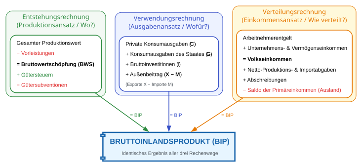
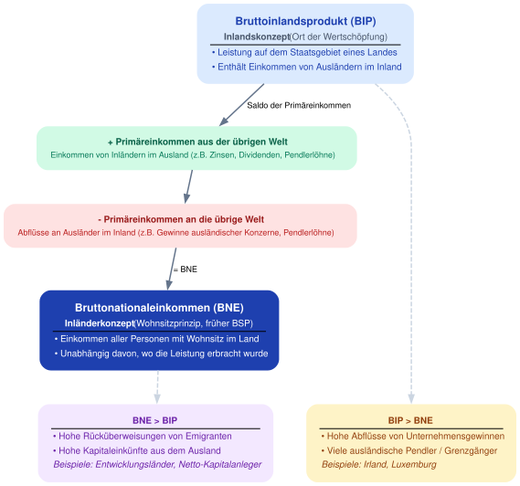
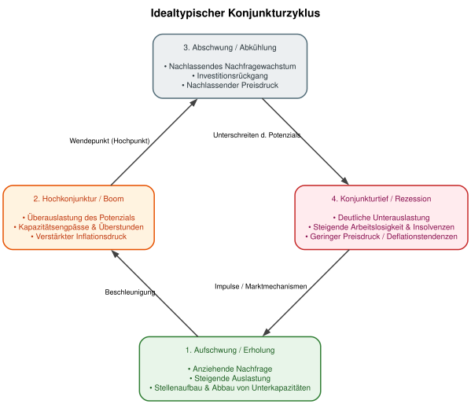

# Volkswirtschaftliche Gesamtrechnungen


## Wozu VGR?

* **Messung der Wirtschaftsleistung:** Quantifizierung von Entstehung, Verteilung und Verwendung des Gesamteinkommens sowie aggregierter Kennzahlen (BIP, BNE, Nettonationaleinkommen).

* **Wirtschaftspolitische Entscheidungsgrundlage:** Datengrundlage für die Ausgestaltung von Finanzpolitik (Haushaltsplanung, Schuldenbremse), Geldpolitik (EZB) sowie Lohn- und Arbeitsmarktpolitik.

* **Konjunktur- und Strukturdiagnose:** Früherkennung von Auf- und Abschwüngen sowie Erfassung des strukturellen Wandels (z. B. Verteilung zwischen Industrie- und Dienstleistungssektor, Entwicklung der Staatsquote).

* **Basis für Prognosen und makroökonomische Forschung:** Empirisches Fundament für ökonometrische Modelle, Input-Output-Analysen und Konjunkturprognosen (z. B. Sachverständigenrat, Wirtschaftsforschungsinstitute).

* **Internationale Vergleichbarkeit:** Standardisierte Regelwerke (ESVG 2010 / SNA) ermöglichen den systematischen Vergleich von Wirtschaftsstruktur und Pro-Kopf-Einkommen zwischen Staaten.

* **Rechtliche und administrative Bemessungsfunktion:**
* Berechnung der BNE-basierten EU-Eigenmittelbeiträge der Mitgliedstaaten.
* Überwachung der europäischen Fiskalregeln (Defizit- und Schuldenstandsquote am BIP).
* Datengrundlage für amtliche Steuerschätzungen und gesetzliche Anpassungsmechanismen (z. B. Rentenentwicklung).


* **Verteilungsanalyse:** Erfassung der primären und sekundären Einkommensverteilung (Funktionale Verteilung wie Lohn- vs. Gewinnquote sowie verfügbares Einkommen der privaten Haushalte).

## Wichtiges Grundkonzept: Das Bruttoinlandsprodukt


### Definition und Berechnungswege

```{python}
#| output: false

import graphviz
from IPython.display import display

# Graph-Objekt initialisieren
dot = graphviz.Digraph(
    'BIP_Berechnungsmethoden',
    format='svg',
    comment='Drei Berechnungsmethoden des BIP'
)

# Globale Layout- und Design-Einstellungen
dot.attr(
    rankdir='TB',
    compound='true',
    nodesep='0.5',
    ranksep='0.8',
    fontname='Arial, sans-serif',
    bgcolor='#ffffff'
)

# Standard-Attributdefinitionen für Knoten und Kanten
dot.attr('node',
    fontname='Arial, sans-serif',
    shape='rectangle',
    style='filled, rounded',
    penwidth='1.5',
    fontsize='11'
)

dot.attr('edge',
    fontname='Arial, sans-serif',
    fontsize='10',
    penwidth='1.5'
)

# -----------------------------------------------------------------------------
# 1. CLUSTER: Entstehungsrechnung (Produktionsansatz)
# -----------------------------------------------------------------------------
with dot.subgraph(name='cluster_entstehung') as c:
    c.attr(
        label='Entstehungsrechnung\n(Produktionsansatz / Wo?)',
        style='filled, rounded',
        fillcolor='#f3f9f4',
        color='#2b8a3e',
        fontcolor='#2b8a3e',
        fontname='Arial-Bold',
        fontsize='13'
    )

    label_entstehung = '''<
    <TABLE BORDER="0" CELLBORDER="0" CELLSPACING="3">
        <TR><TD ALIGN="LEFT">Gesamter Produktionswert</TD></TR>
        <TR><TD ALIGN="LEFT"><FONT COLOR="#e03131">− Vorleistungen</FONT></TD></TR>
        <TR><TD ALIGN="LEFT" COLSPAN="1" BORDER="0" BOTTOM="1" CELLPADDING="0"></TD></TR> <!-- Horizontal rule -->
        <TR><TD ALIGN="LEFT"><B>= Bruttowertschöpfung (BWS)</B></TD></TR>
        <TR><TD ALIGN="LEFT"><FONT COLOR="#2b8a3e">+ Gütersteuern</FONT></TD></TR>
        <TR><TD ALIGN="LEFT"><FONT COLOR="#e03131">− Gütersubventionen</FONT></TD></TR>
    </TABLE>
    >'''

    c.node('entstehung', label=label_entstehung, fillcolor='#ffffff', color='#2b8a3e')

# -----------------------------------------------------------------------------
# 2. CLUSTER: Verwendungsrechnung (Ausgabenansatz)
# -----------------------------------------------------------------------------
with dot.subgraph(name='cluster_verwendung') as c:
    c.attr(
        label='Verwendungsrechnung\n(Ausgabenansatz / Wofür?)',
        style='filled, rounded',
        fillcolor='#edf2ff',
        color='#364fc7',
        fontcolor='#364fc7',
        fontname='Arial-Bold',
        fontsize='13'
    )

    label_verwendung = '''<
    <TABLE BORDER="0" CELLBORDER="0" CELLSPACING="3">
        <TR><TD ALIGN="LEFT">Private Konsumausgaben (<B>C</B>)</TD></TR>
        <TR><TD ALIGN="LEFT">+ Konsumausgaben des Staates (<B>G</B>)</TD></TR>
        <TR><TD ALIGN="LEFT">+ Bruttoinvestitionen (<B>I</B>)</TD></TR>
        <TR><TD ALIGN="LEFT">+ Außenbeitrag (<B>X − M</B>)</TD></TR>
        <TR><TD ALIGN="LEFT"><FONT POINT-SIZE="9" COLOR="#495057">  (Exporte X − Importe M)</FONT></TD></TR>
    </TABLE>
    >'''

    c.node('verwendung', label=label_verwendung, fillcolor='#ffffff', color='#364fc7')

# -----------------------------------------------------------------------------
# 3. CLUSTER: Verteilungsrechnung (Einkommensansatz)
# -----------------------------------------------------------------------------
with dot.subgraph(name='cluster_verteilung') as c:
    c.attr(
        label='Verteilungsrechnung\n(Einkommensansatz / Wie verteilt?)',
        style='filled, rounded',
        fillcolor='#fff9db',
        color='#e67700',
        fontcolor='#e67700',
        fontname='Arial-Bold',
        fontsize='13'
    )

    label_verteilung = '''<
    <TABLE BORDER="0" CELLBORDER="0" CELLSPACING="3">
        <TR><TD ALIGN="LEFT">Arbeitnehmerentgelt</TD></TR>
        <TR><TD ALIGN="LEFT">+ Unternehmens- &amp; Vermögenseinkommen</TD></TR>
        <TR><TD ALIGN="LEFT" COLSPAN="1" BORDER="0" BOTTOM="1" CELLPADDING="0"></TD></TR> <!-- Horizontal rule -->
        <TR><TD ALIGN="LEFT"><B>= Volkseinkommen</B></TD></TR>
        <TR><TD ALIGN="LEFT">+ Netto-Produktions- &amp; Importabgaben</TD></TR>
        <TR><TD ALIGN="LEFT">+ Abschreibungen</TD></TR>
        <TR><TD ALIGN="LEFT"><FONT COLOR="#e03131">− Saldo der Primäreinkommen (Ausland)</FONT></TD></TR>
    </TABLE>
    >'''

    c.node('verteilung', label=label_verteilung, fillcolor='#ffffff', color='#e67700')

# -----------------------------------------------------------------------------
# ZENTRALER KNOTEN: Bruttoinlandsprodukt (BIP)
# -----------------------------------------------------------------------------
label_bip = '''<
<TABLE BORDER="0" CELLBORDER="0" CELLSPACING="4">
    <TR><TD ALIGN="CENTER"><B><FONT POINT-SIZE="15" COLOR="#1864ab">BRUTTOINLANDSPRODUKT (BIP)</FONT></B></TD></TR>
    <TR><TD ALIGN="CENTER"><FONT POINT-SIZE="10" COLOR="#495057">Identisches Ergebnis aller drei Rechenwege</FONT></TD></TR>
</TABLE>
>'''

dot.node('bip', label=label_bip, fillcolor='#e7f5ff', color='#1864ab', penwidth='2.5', shape='component')

# -----------------------------------------------------------------------------
# VERBINDUNGEN / VERKNÜPFUNGEN
# -----------------------------------------------------------------------------
dot.edge('entstehung', 'bip', label=' = BIP', color='#2b8a3e', fontcolor='#2b8a3e')
dot.edge('verwendung', 'bip', label=' = BIP', color='#364fc7', fontcolor='#364fc7')
dot.edge('verteilung', 'bip', label=' = BIP', color='#e67700', fontcolor='#e67700')

# -----------------------------------------------------------------------------
# SPEICHERN ALS SVG UND AUSGABE IN IPYTHON
# -----------------------------------------------------------------------------
# Speichert die Datei als 'bip_berechnungsmethoden.svg' im aktuellen Verzeichnis
dot.render('bip_berechnungsmethoden', format='svg', cleanup=True)

# Anzeige in IPython / Jupyter Notebook
# display(dot)
```



## Verwandtes Konzept: Das Bruttonationaleinkommen

```{python}
#| output: false

import graphviz
from IPython.display import display, SVG

# Create Digraph
dot = graphviz.Digraph(
    name='bip_vs_bne',
    comment='Unterschied und Überleitung von BIP zu BNE',
    format='svg'
)

# Graph-Einstellungen (Modernes, übersichtliches Layout)
dot.attr(
    rankdir='TB',
    fontname='Helvetica, Arial, sans-serif',
    fontsize='12',
    bgcolor='#FFFFFF',
    nodesep='0.5',
    ranksep='0.5',
    compound='true'
)

# Standard-Attribute für Nodes
dot.attr('node',
    fontname='Helvetica, Arial, sans-serif',
    fontsize='10',
    shape='box',
    style='filled,rounded',
    penwidth='0',
    margin='0.2,0.15'
)

# Standard-Attribute für Edges
dot.attr('edge',
    fontname='Helvetica, Arial, sans-serif',
    fontsize='9',
    color='#64748B',
    penwidth='1.5',
    arrowsize='0.8'
)

# ==============================================================================
# 1. HAUPTKONZEPTE (BIP & BNE) + ÜBERLEITUNG
# ==============================================================================

# BIP Node (Inlandskonzept)
bip_label = '''<
<table border="0" cellborder="0" cellspacing="0" cellpadding="2">
  <tr><td><font point-size="12"><b>Bruttoinlandsprodukt (BIP)</b></font></td></tr>
  <tr><td><font color="#475569"><b>Inlandskonzept</b> (Ort der Wertschöpfung)</font></td></tr>
  <hr/>
  <tr><td align="left">• Leistung auf dem Staatsgebiet eines Landes</td></tr>
  <tr><td align="left">• Enthält Einkommen von Ausländern im Inland</td></tr>
</table>>'''

dot.node('BIP', label=bip_label, fillcolor='#DBEAFE', fontcolor='#1E40AF')

# Mathematische Überleitung
plus_label = '''<
<table border="0" cellborder="0" cellspacing="0" cellpadding="1">
  <tr><td><font color="#065F46"><b>+ Primäreinkommen aus der übrigen Welt</b></font></td></tr>
  <tr><td><font color="#047857" point-size="9">Einkommen von Inländern im Ausland (z.B. Zinsen, Dividenden, Pendlerlöhne)</font></td></tr>
</table>>'''

minus_label = '''<
<table border="0" cellborder="0" cellspacing="0" cellpadding="1">
  <tr><td><font color="#991B1B"><b>- Primäreinkommen an die übrige Welt</b></font></td></tr>
  <tr><td><font color="#B91C1C" point-size="9">Abflüsse an Ausländer im Inland (z.B. Gewinne ausländischer Konzerne, Pendlerlöhne)</font></td></tr>
</table>>'''

dot.node('PLUS', label=plus_label, fillcolor='#D1FAE5')
dot.node('MINUS', label=minus_label, fillcolor='#FEE2E2')

# BNE Node (Inländerkonzept)
bne_label = '''<
<table border="0" cellborder="0" cellspacing="0" cellpadding="2">
  <tr><td><font point-size="12"><b>Bruttonationaleinkommen (BNE)</b></font></td></tr>
  <tr><td><b>Inländerkonzept</b> (Wohnsitzprinzip, früher BSP)</td></tr>
  <hr/>
  <tr><td align="left">• Einkommen aller Personen mit Wohnsitz im Land</td></tr>
  <tr><td align="left">• Unabhängig davon, wo die Leistung erbracht wurde</td></tr>
</table>>'''

dot.node('BNE', label=bne_label, fillcolor='#1E40AF', fontcolor='#FFFFFF')

# ==============================================================================
# 2. PRAXISBEISPIELE & ABWEICHUNGEN
# ==============================================================================

bip_gt_bne_label = '''<
<table border="0" cellborder="0" cellspacing="0" cellpadding="2">
  <tr><td><b>BIP &gt; BNE</b></td></tr>
  <hr/>
  <tr><td align="left">• Hohe Abflüsse von Unternehmensgewinnen</td></tr>
  <tr><td align="left">• Viele ausländische Pendler / Grenzgänger</td></tr>
  <tr><td align="left"><i>Beispiele: Irland, Luxemburg</i></td></tr>
</table>>'''

bne_gt_bip_label = '''<
<table border="0" cellborder="0" cellspacing="0" cellpadding="2">
  <tr><td><b>BNE &gt; BIP</b></td></tr>
  <hr/>
  <tr><td align="left">• Hohe Rücküberweisungen von Emigranten</td></tr>
  <tr><td align="left">• Hohe Kapitaleinkünfte aus dem Ausland</td></tr>
  <tr><td align="left"><i>Beispiele: Entwicklungsländer, Netto-Kapitalanleger</i></td></tr>
</table>>'''

dot.node('CASE_BIP_GT', label=bip_gt_bne_label, fillcolor='#FEF3C7', fontcolor='#92400E')
dot.node('CASE_BNE_GT', label=bne_gt_bip_label, fillcolor='#F3E8FF', fontcolor='#6B21A8')

# ==============================================================================
# 3. VERBINDUNGEN (EDGES) & ANORDNUNG
# ==============================================================================

# Hauptfluss (Überleitung)
dot.edge('BIP', 'PLUS', label=' Saldo der Primäreinkommen')
dot.edge('PLUS', 'MINUS')
dot.edge('MINUS', 'BNE', label=' = BNE')

# Verknüpfung der Sonderfälle (gestrichelt)
dot.edge('BIP', 'CASE_BIP_GT', style='dashed', color='#CBD5E1', constraint='true')
dot.edge('BNE', 'CASE_BNE_GT', style='dashed', color='#CBD5E1', constraint='true')

# Ausrichtung der Sonderfälle auf gleicher Höhe
with dot.subgraph() as s:
    s.attr(rank='same')
    s.node('CASE_BIP_GT')
    s.node('CASE_BNE_GT')

# ==============================================================================
# 4. SPEICHERN (SVG) UND DISPLAY (IPython)
# ==============================================================================

# Generiert 'bip_vs_bne.svg' und löscht temporäre Dateien
output_file = dot.render(filename='bip_vs_bne', format='svg', cleanup=True)

print(f"SVG-Datei erfolgreich gespeichert unter: {output_file}")

# Anzeige in IPython / Jupyter Notebook
#display(SVG(filename=output_file))
```



## Schwankungen es BIPs: Konjunktur

### Stilisierter Konjunkturverlauf

```{r}
#| message: false
#| warning: false
#| fig-cap: "Stilisierter Konjunkturverlauf"

library(dplyr)
library(ggplot2)

# Data Frame erstellen und Phase + Block-ID ergänzen
df <- data.frame(x = seq(0, 20, by = 0.2)) %>%
  mutate(
    sinus = sin(x),
    y = 0.35 * x + 0.4 * sinus,
    Phase = case_when(
      sinus < 0  & cos(x) >= 0 ~ "Erholung",
      sinus >= 0 & cos(x) >= 0 ~ "Boom",
      sinus >= 0 & cos(x) < 0  ~ "Abkühlung",
      sinus < 0  & cos(x) < 0  ~ "Rezession"
    ),
    Phase = factor(Phase, levels = c("Erholung", "Boom", "Abkühlung", "Rezession")),
    # Generiert eine fortlaufende ID pro Phasenblock (verhindert Fehlverbindungen im Ribbon)
    block_id = consecutive_id(Phase)
  )

# Plot mit Hintergrundbändern
df %>%
  ggplot(aes(x = x, y = y)) +
  # Farblicher Hintergrund über

  geom_ribbon(
  aes(ymin = 0.35 * x, ymax = y, fill = Phase, group = block_id),
  alpha = 0.4
)+

  # Trendlinie (gestrichelt)
  geom_line(aes(y = 0.35 * x), color = "blue", linetype = "dashed", linewidth = 0.8) +
  # Konjunkturverlauf (durchgezogen)
  geom_line(color = "black", linewidth = 0.9) +
  scale_fill_manual(values = c(
    "Erholung"  = "yellow",
    "Boom"      = "green",
    "Abkühlung" = "orange",
    "Rezession" = "red"
  )) +
  # Achsenbeschriftungen / Breaks entfernen
  scale_x_continuous(breaks = NULL) +
  scale_y_continuous(breaks = NULL) +
  theme_light() +
  labs(
    title = "Stilisierter Konjunkturverlauf",
    x = "Zeit",
    y = "BIP",
    fill = "Konjunkturphase"
  )
```


```{python}
#| output: false

import graphviz
from IPython.display import display, SVG

# Digraph mit der 'circo'-Engine für eine automatische kreisförmige Anordnung
dot = graphviz.Digraph(
    name='konjunkturzyklus',
    comment='Vier Phasen des Konjunkturzyklus',
    engine='circo'
)

# Globale Layout- und Stileinstellungen
dot.attr(
    bgcolor='white',
    label='Idealtypischer Konjunkturzyklus\n ',
    labelloc='t',
    fontname='Helvetica-Bold',
    fontsize='14'
)

dot.attr('node',
    shape='box',
    style='filled,rounded',
    fontname='Helvetica',
    fontsize='10',
    margin='0.2,0.15',
    penwidth='1.5'
)

dot.attr('edge',
    fontname='Helvetica',
    fontsize='9',
    penwidth='1.5',
    arrowsize='0.8',
    color='#424242'
)

# 1. Aufschwung / Erholung
dot.node('aufschwung',
    label='1. Aufschwung / Erholung\n\n• Anziehende Nachfrage\n• Steigende Auslastung\n• Stellenaufbau & Abbau von Unterkapazitäten',
    fillcolor='#E8F5E9',
    color='#2E7D32',
    fontcolor='#1B5E20'
)

# 2. Hochkonjunktur / Boom
dot.node('boom',
    label='2. Hochkonjunktur / Boom\n\n• Überauslastung des Potenzials\n• Kapazitätsengpässe & Überstunden\n• Verstärkter Inflationsdruck',
    fillcolor='#FFF3E0',
    color='#E65100',
    fontcolor='#BF360C'
)

# 3. Abschwung / Abkühlung
dot.node('abschwung',
    label='3. Abschwung / Abkühlung\n\n• Nachlassendes Nachfragewachstum\n• Investitionsrückgang\n• Nachlassender Preisdruck',
    fillcolor='#ECEFF1',
    color='#546E7A',
    fontcolor='#263238'
)

# 4. Konjunkturtief / Rezession
dot.node('tief',
    label='4. Konjunkturtief / Rezession\n\n• Deutliche Unterauslastung\n• Steigende Arbeitslosigkeit & Insolvenzen\n• Geringer Preisdruck / Deflationstendenzen',
    fillcolor='#FFEBEE',
    color='#C62828',
    fontcolor='#880E4F'
)

# Phasenübergänge (gerichteter Kanten-Zyklus)
dot.edge('aufschwung', 'boom', label=' Beschleunigung')
dot.edge('boom', 'abschwung', label=' Wendepunkt (Hochpunkt)')
dot.edge('abschwung', 'tief', label=' Unterschreiten d. Potenzials')
dot.edge('tief', 'aufschwung', label=' Impulse / Marktmechanismen')

# 1. Als SVG-Datei speichern ('konjunkturzyklus.svg')
dot.render('konjunkturzyklus', format='svg', cleanup=True)

# 2. Direkt in IPython / Jupyter Notebook rendern
#display(SVG(filename='konjunkturzyklus.svg'))
```



### Probleme des stilisierten Konjunktuverlaufs

- Empirische Konjunkturverläufe sind nicht so schön symmetrisch

- Was ist der Trend? Er ist nicht (direkt) beobachtbar  
  - Entweder ex ante Potenzialoutput schätzen (hohe Informationsanforderungen) oder  
  - ex post möglichst gute Anpassung an die Beobachtungen finden
  
  - einfacher linearer Trend ist aber vermutlich nicht sinnvoll
  
  - daher Filter, der sowohl langfristige Entwicklungen als auch *Änderungen* der langfristigen Entwicklungen berücksichtigt
  
### Der Hodrick-Prescott-Filter

$$HP= min_{T_t} \left( \sum_{t=1}^{N} (Y_t - T_t)^2 + \lambda \sum_{t=2}^{N-1} ((T_{t+1} - T_t) - (T_t - T_{t-1}))^2 \right)$$
Die Gleichung hat zwei Komponenten

- **Anpassungsgüte** ($\sum (Y_t - T_t)^2$): Der erste Teil der Gleichung bestraft die Abweichung des Trends ($T_t$) von der ursprünglichen Zeitreihe ($Y_t$). Je größer die Abweichungen, desto größer ist dieser Term. Dies stellt sicher, dass der Trend den Daten "folgt".

- **Glättungskomponente** ($\lambda \sum ((T_{t+1} - T_t) - (T_t - T_{t-1}))^2$): Der zweite Teil bestraft die Veränderung der Wachstumsrate des Trends. Er sorgt dafür, dass der Trend möglichst glatt und nicht "zackig" ist.

Wahl von $\lambda$: Für Jahresdaten sind Werte wie 6,25 oder 100 üblich.


## Entwicklung zentraler makroökonomischer Größen

```{r}
#| message: false
#| warning: false

library(rdbnomics)
library(dplyr)
library(ggplot2)

message("Lade reales BIP pro Kopf der G7-Staaten via DBnomics (Weltbank)...")

g7_countries <- c("CAN", "FRA", "DEU", "ITA", "JPN", "GBR", "USA")

df_gdp_pc <- rdb(
  provider_code = "WB",
  dataset_code  = "WDI",
  dimensions    = list(
    country   = g7_countries,
    indicator = "NY.GDP.PCAP.KD"
  )
)

country_names <- c(
  "CAN" = "Kanada",
  "FRA" = "Frankreich",
  "DEU" = "Deutschland",
  "ITA" = "Italien",
  "JPN" = "Japan",
  "GBR" = "Großbritannien",
  "USA" = "USA"
)

gdp_pc_clean <- df_gdp_pc %>%
  mutate(country_code = toupper(country)) %>%
  mutate(country_label = country_names[country_code]) %>%
  mutate(year = as.numeric(substr(as.character(period), 1, 4))) %>%
  select(country = country_label, year, gdp_pc = value) %>%
  filter(!is.na(gdp_pc) & !is.na(country)) %>%
  filter(year >= 1990)

ggplot(gdp_pc_clean, aes(x = year, y = gdp_pc, color = country)) +
  geom_line(linewidth = 0.8) +
  geom_point(size = 1.5) +
  scale_color_brewer(palette = "Set1", name = "Land") +
  scale_y_continuous(#limits = c(0, NA),
                       labels = scales::dollar_format(suffix = " USD", prefix = ""), breaks = scales::pretty_breaks(n = 8)) +
  labs(
    title    = "Reales BIP pro Kopf in den G7-Staaten",
    subtitle = "In konstanten US-Dollar (Basisjahr 2015), ab 1990",
    x        = "Jahr",
    y        = "Reales BIP pro Kopf (USD)",
    caption  = "Datenquelle: Weltbank (WDI) / Indikator NY.GDP.PCAP.KD via DBnomics"
  ) +
  theme_light(base_size = 12) +
  theme(
 #   plot.title      = element_text(face = "bold"),
    legend.position = "bottom",
    legend.title    = element_text(face = "bold")
  )
```


### Beschäftigung

### Inflation

```{r}
#| warning: false
#| message: false

library(rdbnomics)
library(dplyr)
library(ggplot2)

message("Lade Inflationsraten der G7-Staaten via DBnomics (Weltbank)...")

# 1. Länderliste (ISO3-Codes) für G7
g7_countries <- c("CAN", "FRA", "DEU", "ITA", "JPN", "GBR", "USA")

# 2. Datenabruf über die Weltbank (WB)
# FP.CPI.TOTL.ZG = Inflation, consumer prices (annual %)
df_inflation <- rdb(
  provider_code = "WB",
  dataset_code  = "WDI",
  dimensions    = list(
    country   = g7_countries,
    indicator = "FP.CPI.TOTL.ZG"
  )
)

# 3. Ländernamen für die Beschriftung
country_names <- c(
  "CAN" = "Kanada",
  "FRA" = "Frankreich",
  "DEU" = "Deutschland",
  "ITA" = "Italien",
  "JPN" = "Japan",
  "GBR" = "Großbritannien",
  "USA" = "USA"
)

# 4. Daten aufbereiten
inflation_clean <- df_inflation %>%
  mutate(country_code = toupper(country)) %>%
  mutate(country_label = country_names[country_code]) %>%
  mutate(year = as.numeric(substr(as.character(period), 1, 4))) %>%
  # Relevante Spalten auswählen und sauber benennen
  select(country = country_label, year, inflation_rate = value) %>%
  # Unvollständige Daten filtern
  filter(!is.na(inflation_rate) & !is.na(country)) %>%
  # Zeitreihe ab 1990 filtern
  filter(year >= 1990)

# 5. Zeitreihenplot erstellen
ggplot(inflation_clean, aes(x = year, y = inflation_rate, color = country)) +
  # Null-Linie hilft, Deflationsphasen (z.B. in Japan) sofort zu erkennen
  geom_hline(yintercept = 0, linetype = "dashed", color = "black", linewidth = 0.6) +
  geom_line(linewidth = 0.8) +
  geom_point(size = 1.5) +
  scale_color_brewer(palette = "Set1", name = "Land") +
  # Y-Achse zentriert bei 0 beginnen zu lassen ist bei Inflation schwer, da es negative Werte gibt
  scale_y_continuous(breaks = scales::pretty_breaks(n = 8)) +
  labs(
    title    = "Inflationsrate in den G7-Staaten",
    subtitle = "Veränderung des Verbraucherpreisindex zum Vorjahr in %, ab 1990",
    x        = "Jahr",
    y        = "Inflationsrate (%)",
    caption  = "Datenquelle: Weltbank (WDI) via DBnomics"
  ) +
  theme_minimal(base_size = 12) +
  theme(
    plot.title      = element_text(face = "bold"),
    legend.position = "bottom",
    legend.title    = element_text(face = "bold")
  )
```


```{r}
library(knitr)
library(kableExtra)

# Data Frame erstellen
bip_df <- data.frame(
  Berechnungsmethode = c("Entstehungsrechnung", "Verwendungsrechnung", "Verteilungsrechnung"),
  `Blickwinkel / Perspektive` = c(
    "Produktion:\nWo und durch welche Branchen wird der Mehrwert erbracht?",
    "Nachfrage:\nWofür wird die Wirtschaftsleistung verwendet?",
    "Einkommen:\nWie wird der Ertrag auf Arbeit und Kapital verteilt?"
  ),
  Berechnungsschema = c(
    "Summe der Bruttowertschöpfung aller Branchen\n+ Gütersteuern abzüglich Gütersubventionen\n= BIP",
    "Private Konsumausgaben (C)\n+ Konsumausgaben des Staates (G)\n+ Bruttoinvestitionen (I)\n+ Außenbeitrag (Exporte X − Importe M)\n= BIP",
    "Arbeitnehmerentgelt\n+ Unternehmens- und Vermögenseinkommen (= Volkseinkommen)\n+ Produktions- und Importabgaben netto\n+ Abschreibungen\n− Saldo der Primäreinkommen aus der übrigen Welt\n= BIP"
  ),
  check.names = FALSE
)

# Variante A: Einfache Markdown/Pipe-Tabelle für Quarto/Rmd (nutzt \n als HTML-Break)
kable(bip_df, format = "pipe")

# Variante B: Mit kableExtra für HTML-/PDF-Output mit fester Spaltenbreite
bip_df %>%
  kbl(escape = FALSE) %>%
  kable_styling(full_width = FALSE, bootstrap_options = c("striped", "hover")) %>%
  column_spec(1, width = "12em", bold = TRUE) %>%
  column_spec(2, width = "18em") %>%
  column_spec(3, width = "25em")
```

